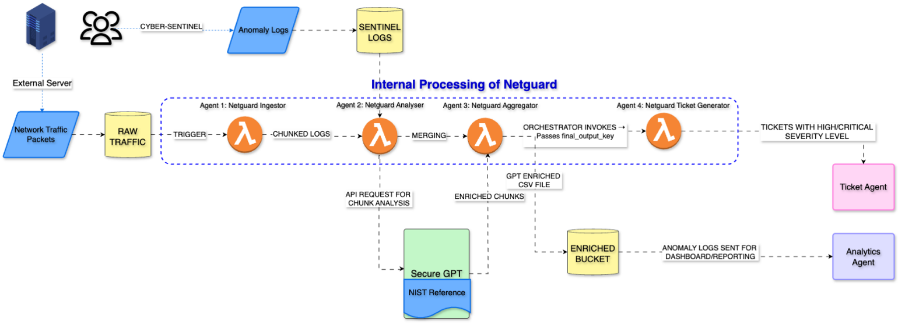
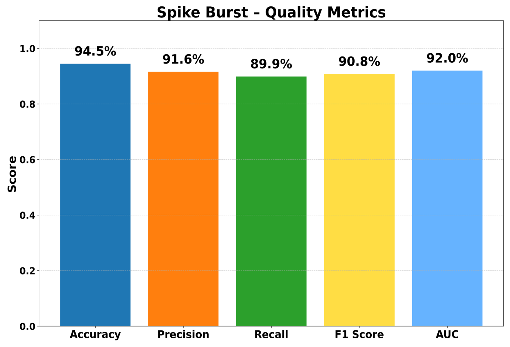

# DAEN-690-NetGuard
# NetGuard – Agentic AI for Real‑Time Network Traffic Monitoring & Proactive Threat Mitigation
> **Course:** DAEN 690 • Spring 2025  
> **Team:** Rishav Aryan · Durga Prasad Esampelly · Artum Khorshid · Prudhvi Sandeep Mudidana · Samhita Sarikonda · Ravi Teja Talluri

## Overview
The NetGuard Project Create Network Traffic Monitoring and Threat Mitigation Agent is an AI-powered cybersecurity system that may automatically reduce security risks by monitoring network traffic continuously, identifying dangers from non-compliant logs, and taking appropriate action. Our objective is to create an intelligent agent that proactively detects and reacts to cyber threats in real-time, hence enhancing network security. 

The NIST Cybersecurity Framework alignment is a crucial component of this project, guaranteeing that our strategy adheres to industry best practices for threat detection, incident response, and compliance. By integrating automation, machine learning, and secure AI models, NetGuard improves the capacity to identify weaknesses and stop security breaches before they have a negative impact. 

The NetGuard AI Agent's source code, documentation, and implementation details are all available in this GitHub repository. Real-time network monitoring, automatic threat detection, and security procedures that enable prompt action when threats are detected are all supported by the system's structured development methodology. Testing procedures, deployment plans, and a roadmap for upcoming enhancements are all included in the repository.  

NetGuard is designed for efficiency, flexibility, and ongoing learning by utilizing AWS Lambda for serverless execution, SecureGPT for intelligent analysis, and cloud storage options for scalable data management. This project provides a framework for businesses wishing to use AI-driven automation to strengthen their cybersecurity posture. 

## 🧪 Datasets Used
- `network_packets.csv`: Simulated network traffic with fields like Protocol, Flags, PacketSize, Status
- `anomaly_logs.csv`: Generated by Faker with AnomalyType, LogLevel, NISTReference
- `NIST.SP.800-53r5.pdf`: Grounding document for SecureGPT

  
## 🧩 System Architecture

NetGuard is composed of four core Lambda agents deployed in a serverless pipeline:

- **Agent 1 - NetGuard Ingestor**: S3-triggered Lambda that preprocesses and chunks raw traffic files.
- **Agent 2 - NetGuard Analyzer**: Matches logs with anomalies and invokes SecureGPT for enrichment.
- **Agent 3 - NetGuard Aggregator**: Merges chunked outputs into a unified final log.
- **Agent 4 - Ticket Generator**: Automatically creates JIRA tickets for critical threats.

All enriched outputs are uploaded to Cyber Vision for dashboard integration.

---

## 🤖 Agent Breakdown

### 1. `NetGuard Ingestor`
- **Trigger**: S3 event (new file uploaded)
- **Tasks**: Normalize, chunk, and store logs
- **Output**: 100-row CSV chunks in `netguard-analyzed-chunks/`

### 2. `NetGuard Analyzer`
- **Input**: Chunked packets + anomaly logs
- **Logic**:
  - Match IPs with anomaly logs
  - Construct structured SecureGPT prompt
  - Receive: ThreatSeverity, ActionTaken, Explanation
- **Output**: Enriched CSV

### 3. `NetGuard Aggregator`
- **Input**: Analyzed chunks
- **Tasks**: Validate, concatenate, and export full report
- **Output**: Final threat log in `netguard-final-output-logs/`

### 4. `NetGuard Ticket Generator`
- **Trigger**: New file in final output bucket
- **Logic**:
  - Filter High/Critical threats
  - Push JIRA tickets via API

---

## 🔐 SecureGPT Integration
SecureGPT, hosted by Accure.ai, is a fine-tuned LLaMA model:
- **Use cases**: Threat classification, mitigation strategy, and compliance explanation
- **Prompt styles**:
  - Severity Assistant
  - Mitigation Planner
  - Explanation Generator
- **Document grounding**: `NIST.SP.800-53r5.pdf`
- **Response format**: Structured JSON

---

## 🧪 Testing & Evaluation
| Dataset Size | Accuracy | Precision | Recall | F1-Score | ROC AUC |
|--------------|----------|-----------|--------|----------|---------|
| 3000 rows    | 90.9%    | 92.4%     | 96.6%  | 94.5%    | 0.93    |
| 6000 rows    | 94.5%    | 91.6%     | 89.9%  | 90.8%    | 0.92    |

- **Post-Reflexion Improvements**: Reflexive updates improved precision.
- **Load Handling**: Parallel chunking & SecureGPT invocation scaled efficiently.

---

## 🎬 Demo Video (Google Drive)

---

## 🚀 Deployment Stack
- **Infrastructure**: AWS Lambda, S3, CloudWatch, IAM
- **Data Handling**: Pandas, boto3
- **Inference API**: SecureGPT (Accure.ai)
- **Ticketing**: JIRA REST API

---

## 📈 Future Work
- Add real-time packet capture (PyShark/Scapy)
- Switch to EC2 for higher volume processing
- Integrate Splunk/ELK dashboards from Cyber Vision
- Support other frameworks (MITRE ATT&CK)

---

## 🧠 Team
- Rishav Aryan
- Durga Prasad Esampelly
- Artum Khorshid
- Prudhvi Sandeep Mudidana
- Samhita Sarikonda
- Ravi Teja Talluri

---

## 📚 References
- NIST Cybersecurity Framework  
- Accure Inc. SecureGPT API Docs  
- Erasmus.AI Agentic AI Insights

---

> ✨ Empowering proactive cyber defense through agentic intelligence.
"""

# Save as README.md
output_path = Path("/mnt/data/README.md")
output_path.write_text(readme_content)

output_path

